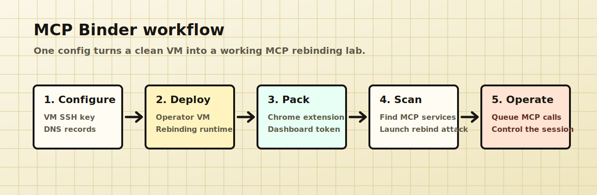

# MCP Binder

<p align="center">
  <a href="LICENSE"></a>
  
  
  
  
  
</p>

MCP Binder turns local MCP DNS-rebinding bugs into a live, repeatable lab.

Use it to scan local MCP servers from Chrome, launch a DNS rebinding attack through your own VM and DNS zone, capture the MCP session, and operate it from a token-protected dashboard. The same workflow supports vulnerability research, internal product security reviews, disclosure demos, and defensive regression testing.


## Why MCP Binder Exists

Local MCP servers often bind to loopback and assume that `127.0.0.1` is a trust boundary. That assumption fails when a server accepts traffic for a hostname that can later resolve to a local service.

This framework came out of research that identified more than 50 DNS-rebinding vulnerabilities across well-known MCP servers. Public examples reported by our security team include [GitLab MCP DNS rebinding](https://github.com/zereight/gitlab-mcp/security/advisories/GHSA-vmp7-252j-cwp7) and [DBHub DNS rebinding](https://github.com/bytebase/dbhub/security/advisories/GHSA-fm8p-53ww-hf6w). There are many others.

MCP Binder exists so researchers and defenders can reproduce this class of vulnerability with flexible infrastructure, clear session tracking, and a workflow that can move between different MCP servers, DNS providers, and VM providers. On the defensive side, it gives teams a concrete way to test Origin and Host validation, confirm whether browser-based access to local MCP surfaces is blocked, and regression-test hardened MCP deployments before shipping.

## Framework Modules

| Module | What It Does |
| --- | --- |
| Framework config | Defines the VM, dashboard domain, rebinding domain, and extension settings for one lab. |
| Framework CLI | Deploys the lab over SSH, packs the Chrome extension, writes dashboard token material, and keeps provider-specific helpers optional. |
| Singularity runtime | Uses [Singularity of Origin](https://github.com/nccgroup/singularity) as the DNS-rebinding engine. |
| Scanner extension | Finds browser-reachable MCP services, then launches the configured DNS rebinding attack against the selected MCP server. |
| Dashboard and operator console | Tracks captured sessions, shows bridge telemetry, and lets the researcher queue MCP JSON-RPC requests. |

## Setup Contract

You provide:

- a Linux VM reachable over SSH;
- DNS records that point a dashboard hostname and delegated rebinding zone to that VM;
- inbound rules for SSH, dashboard HTTP, DNS, and the selected rebinding ports.

MCP Binder provides:

- an SSH-based VM installer;
- a pinned Singularity runtime;
- the dashboard service and rebinding payloads;
- a deployment-specific Chrome extension build;
- dashboard and ingest token material for that lab.

## Workflow



## Prerequisites

Before running MCP Binder, prepare:

| Requirement | What You Need |
| --- | --- |
| VM | A Linux VM reachable over SSH, with a private key and a user that can run `sudo`. |
| DNS records | A dashboard hostname, a nameserver hostname, and a delegated rebinding domain that point to the VM. |
| Inbound access | Provider firewall rules for SSH, dashboard HTTP, rebinding HTTP ports, and DNS. The exact rules depend on your VM provider. |

The required DNS shape is:

```text
dashboard.example.com.      A   <vm-public-ip>
ns1.rebind.example.com.     A   <vm-public-ip>
rebind.example.com.         NS  ns1.rebind.example.com.
```

The dashboard hostname must stay outside the delegated rebinding zone.

## Quickstart

Create a deployment config:

```sh
cp framework-config.template.json deployment.framework-config.json
```

Edit `deployment.framework-config.json` with your VM IP, SSH user, SSH key path, dashboard hostname, and rebinding domain.

You only need to fill these fields:

```json
{
  "operator": {
    "public_ip": "203.0.113.10",
    "ssh_host": "203.0.113.10",
    "ssh_user": "ubuntu",
    "ssh_key_path": "~/.ssh/mcp-binder.pem"
  },
  "dns": {
    "rebind_domain": "rebind.example.com",
    "dashboard_fqdn": "dashboard.example.com"
  }
}
```

Build the lab:

```sh
node scripts/framework-cli.js bootstrap \
  --config deployment.framework-config.json \
  --out dist/mcp-binder-lab \
  --deploy \
  --clear-existing
```

The dashboard token is stored at `dist/mcp-binder-dashboard-token` unless you override it in the config. The token gates the dashboard and operator console so another user who finds the dashboard URL cannot queue MCP commands or read captured sessions. The deploy flow also creates an internal ingest token for the packed extension. The dashboard will not start without that ingest token in normal mode.

> [!WARNING]
> The default dashboard is served over HTTP to keep the first lab setup provider-neutral. Restrict dashboard inbound access to your operator network. Use a TLS reverse proxy for shared, public, or long-lived labs. See [Security Hardening](docs/security-hardening.md).

If the lab build fails, use [Troubleshooting](docs/troubleshooting.md) to test DNS, SSH, VM services, dashboard access, and extension packing one module at a time.

DNS rebinding only works for ports exposed by the deployed Singularity runtime and allowed by the VM inbound rules. If the selected MCP runs outside the default rebinding port window, update `singularity.http_ports` before deploying. See [Choosing Singularity Ports](docs/deployment.md#choosing-singularity-ports).

Load the extension:

```text
chrome://extensions -> Developer mode -> Load unpacked -> dist/mcp-binder-lab/extension
```

After the extension is loaded, follow the live workflow in [docs/operation.md](docs/operation.md).

For the full setup flow, read [docs/deployment.md](docs/deployment.md). For configuration and provider notes, read [docs/configuration.md](docs/configuration.md). For command details, read [docs/cli.md](docs/cli.md).

## Documentation

| Page | Use It For |
| --- | --- |
| [Deployment](docs/deployment.md) | First lab setup, SSH deployment, dashboard token, extension loading, cleanup. |
| [Configuration](docs/configuration.md) | Framework config fields, DNS records, Route53 helper, network rules. |
| [Infrastructure](docs/infrastructure.md) | Provider-neutral VM, DNS, and inbound-rule contract. |
| [Operation](docs/operation.md) | Scanner behavior, DNS rebinding attack flow, dashboard, and operator console. |
| [Target Profiles](docs/target-profiles.md) | MCP target-profile schema, examples, and safe task guidance. |
| [CLI Reference](docs/cli.md) | Supported commands and common options. |
| [Architecture](docs/architecture.md) | Components, data flow, trust boundaries, and compatibility notes. |
| [Threat Model](docs/threat-model.md) | Protected assets, assumptions, risks, and explicit non-goals. |
| [Troubleshooting](docs/troubleshooting.md) | Test config, DNS, SSH, VM services, dashboard, and extension packing one module at a time. |
| [Security Hardening](docs/security-hardening.md) | Implemented controls, HTTP dashboard risk, TLS guidance, and residual hardening notes. |
| [Security Policy](SECURITY.md) | How to report vulnerabilities in MCP Binder itself. |
| [Testing](docs/testing.md) | Mock MCP demo mode and local regression checks. |

## License

MCP Binder is released under the [Apache License 2.0](LICENSE).
