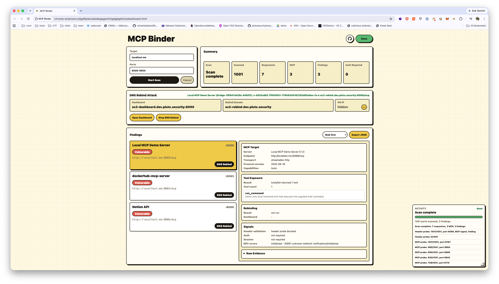
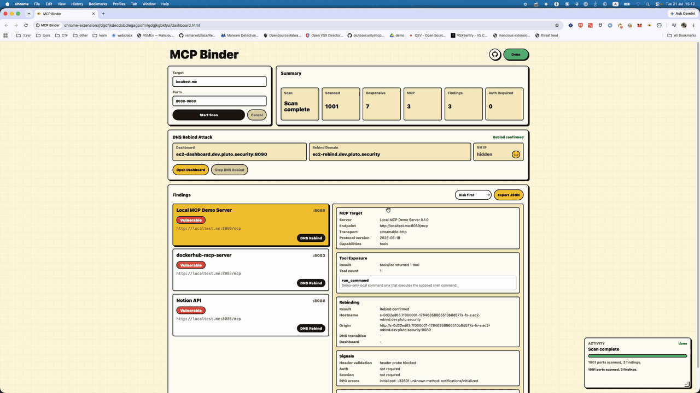
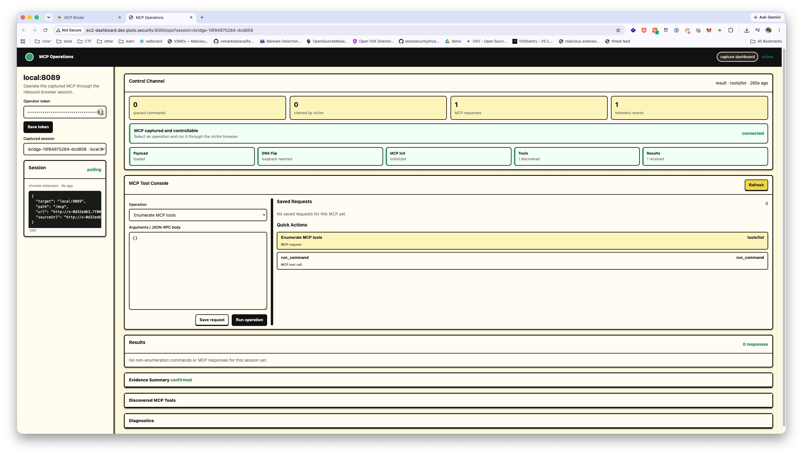
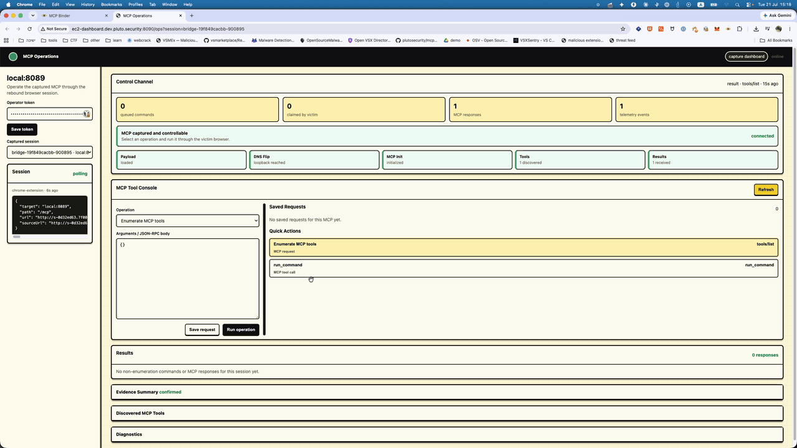

# Operation

This page covers the live workflow after the VM is deployed and the packed Chrome extension is loaded.

Use [Demo Mode](testing.md#demo-mode) when recording, presenting, or validating the flow without depending on a third-party MCP server.

The operating loop is:

```text
Scan -> Select MCP -> DNS Rebind -> Open Dashboard -> Operate
```

## Before You Start

Confirm these pieces are ready:

| Check | Expected |
| --- | --- |
| Extension | Loaded from `dist/mcp-binder-lab/extension` or another packed output directory. |
| Dashboard | `http://<dashboard-domain>:8090/healthz` returns `200 OK`. |
| Token | `dist/mcp-binder-dashboard-token` exists locally. |
| Rebinding ports | The selected MCP port is included in `singularity.http_ports` and allowed by the VM inbound rules. |

If one of these fails, use [Troubleshooting](troubleshooting.md) before debugging the browser flow.

For a controlled demo, start the mock MCP lab from [Testing](testing.md#demo-mode), scan `localtest.me`, and select a mock MCP port that is exposed by the deployed Singularity runtime.

## 1. Run The Scanner

Open the extension dashboard from Chrome.

Use `localtest.me` for local MCP scanning. It resolves to loopback while still exercising a hostname-based browser request path.

Typical scan:

```text
Target: localtest.me
Ports: 8000-9000
```

Click **Start Scan**. The Activity panel tracks port scan progress, MCP probes, and policy blocks.

Common scan outcomes:

| UI State | Meaning |
| --- | --- |
| `Scan complete` | The scan finished across the requested port range. |
| `MCP detected` | The service answered like an MCP server, but no rebinding proof has run yet. |
| `Vulnerable` | The scanner found browser-reachable MCP behavior that should be validated with a DNS rebinding attack. |
| `Scan blocked` | Chrome Site access does not allow the extension to use that scan origin. |

The scanner and the DNS rebinding attack use different browser origins. The scanner discovers candidates through an allowed scan origin such as `localtest.me`. The rebinding attack uses the packed rebinding domain, then relies on DNS changing that hostname to the local MCP service. That is the point of the proof: the extension only needs permission for the rebinding domain, not for the final loopback address.

If discovery is blocked, use an allowed scan origin or pack the extension with the scan host permission you want to test. Do not scan direct `127.0.0.1` unless you are intentionally testing extension permissions rather than DNS rebinding behavior.



## 2. Launch DNS Rebinding

Click **DNS Rebind** on the MCP finding you want to prove.

The extension starts the attack through the packed Singularity configuration. The browser page does not open a normal tab for the proof. The bridge runs through the extension offscreen document so Chrome tab-level protections do not change the behavior being tested.

During the attack:

- the Activity panel shows retry and bridge state;
- the selected finding remains visible;
- the dashboard receives a victim session when the rebound payload loads;
- the selected MCP becomes controllable only after MCP initialization succeeds.

MCP Binder supports one active DNS rebind bridge at a time. If a bridge is already running, starting a new one asks whether to stop the current bridge and start the selected MCP server.

When the proof succeeds, the finding gets **Open Dashboard**. Use that button to jump to the captured MCP session.



## 3. Use The Dashboard

Open the dashboard:

```text
http://<dashboard-domain>:8090
```

Enter the token from:

```sh
cat dist/mcp-binder-dashboard-token
```

The dashboard shows:

| Area | Purpose |
| --- | --- |
| Victims | Browser sessions created by rebound payloads. |
| MCPs | Captured MCP sessions tied to the selected victim. |
| Raw telemetry | Session metadata, source URL, target path, bridge status, and telemetry. |
| Operator controls | Token-protected controls such as token storage and clear live state. |

Use the captured MCP session link or the extension **Open Dashboard** button to enter the operation view at `/ops`.



## 4. Operate The Captured MCP

The operation view is:

```text
http://<dashboard-domain>:8090/ops
```

If you opened it from the extension, the URL includes the captured session ID.

The normal control flow:

1. Select the captured session.
2. Click **Queue tools/list** or choose **Enumerate MCP tools**.
3. Wait for the victim browser to claim the queued command.
4. Review discovered tools.
5. Select a tool or quick action.
6. Fill the JSON arguments.
7. Click **Run operation**.
8. Review the result.

The operator console supports:

| Control | Use |
| --- | --- |
| Operation selector | Choose `tools/list`, a discovered `tools/call`, or a raw JSON-RPC body. |
| Arguments editor | Provide JSON arguments for the selected operation. |
| Saved Requests | Store repeatable requests for the current MCP workflow. |
| Quick Actions | Run generated operations based on `tools/list`. |
| Results | Inspect queued, claimed, completed, and failed MCP tasks. |
| Evidence Summary | Summarize the captured session, discovered tools, and command results. |

Only run `tools/call` against systems you are authorized to test. Passive scanning does not call MCP tools.



## 5. Read Attack Outcomes

Common proof outcomes:

| Outcome | Meaning |
| --- | --- |
| `rebind_confirmed` | The browser reached the target MCP through the rebound hostname and MCP initialization succeeded. |
| `blocked_by_host_validation` | The MCP service rejected the rebound host or origin. |
| `blocked_by_lna` | Browser local-network controls blocked the request path. |
| `blocked_by_cors` | Browser CORS policy blocked the request path. |
| `dns_not_rebound` | DNS did not transition to the local target during the proof window. |
| `mcp_not_detected` | The target responded, but not as an MCP server. |
| `inconclusive` | The bridge reached something, but the response was not enough to prove the MCP state. |
| `stopped` | The operator stopped the active bridge. |

Use the Activity panel and dashboard telemetry together. The extension shows browser-side progress. The dashboard shows victim sessions, command polling, and MCP result state.

## 6. Fast Troubleshooting

| Symptom | Check |
| --- | --- |
| Scan is blocked before it starts | The scan origin is not allowed by Chrome Site access or `extension.host_permissions`. Use an allowed discovery hostname or repack the extension. See [Configuration](configuration.md). |
| Finding appears, but rebinding never reaches the MCP | `singularity.http_ports` and VM inbound rules. See [Choosing Singularity Ports](deployment.md#choosing-singularity-ports). |
| Dashboard opens, but operator API fails | Dashboard token. See [Dashboard Token](deployment.md#dashboard-token). |
| Victim session appears, but no MCP initializes | Target path, transport mode, selected port, and raw dashboard telemetry. |
| Generated rebound hostnames fail in console logs | Expected until DNS records and VM services are ready. If runtime checks pass, inspect the Activity panel details. |

For full recovery steps, use [Troubleshooting](troubleshooting.md).
